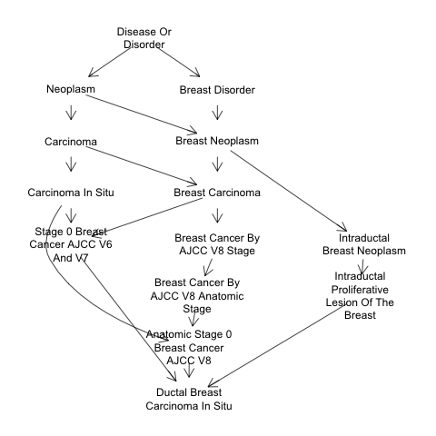
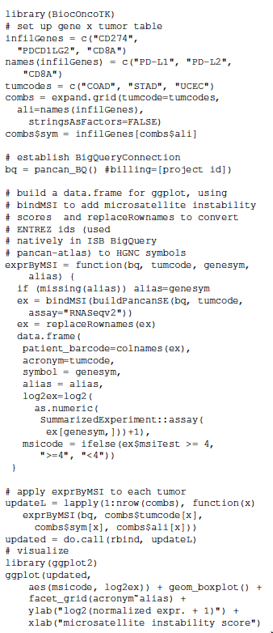

```{r setup, include=FALSE}
library(tufte)
# invalidate cache when the tufte version changes
knitr::opts_chunk$set(tidy = FALSE, cache.extra = packageVersion('tufte'))
options(htmltools.dir.version = FALSE)
suppressPackageStartupMessages({
library(rhdf5client)
library(BiocStyle)
library(restfulSE)
library(restfulSEData)
library(ggplot2)
library(BiocOncoTK)
library(ontoProc)
library(SRAdbV2)
library(UpSetR)
library(MultiAssayExperiment)
library(htxcomp)
set.seed(1234)
})
```

# **Introduction**

`r newthought("Strategic thinking about computing")` for
cancer genomics
involves a panoply of concepts evolving
in an unstable technological domain.^[One snapshot of current approaches 
can be found at Broad's CGCA site
https://www.broadinstitute.org/cancer/cancer-genome-computational-analysis]
In this computable document,
we lay out a series of concepts and examples
around which our basic developmental
strategy for cloud-oriented Bioconductor:Cancer
can be understood.
**All demonstrations are based on Bioconductor 3.9 using R 3.6.**

# **Basic map of the situation**

We will use the term "architecture" in conjunction
with the following broad categories of relevance
to computing for cancer genomics.

- **Conceptual architecture:** How are formal ontologies^[
See the OBO Foundry Principles document (http://www.obofoundry.org/principles/fp-000-summary.html).],
APIs, and concrete data tables used together
efficiently to identify key biological and
therapeutic processes in cancer?^[The Genomics API concept is helpfully reviewed in @Swaminathan2016.]
- **Data architecture:** How are cohorts, trials, experiments, samples,
quantifications, and annotations best represented for 
efficient 
solutions to problems arising in computational biology of cancer?
Are cloud-scale approaches to managing and interrogating
"big data" effectively usable by a community of researchers with
diverse interests and computational skills?

- **Analysis architecture:**  How can advances in conceptual
and data architecture help to accelerate the development
of compelling new interpretations of existing and new
experiments in cancer genomics?

In what follows we aim to get very concrete about the
ways in which the Bioconductor:Cancer project delivers advances
in these areas.

# **Conceptual architecture for FAIRness in cancer genomics**

The FAIR (Findable, Accessible, Interoperable,
Reusable) principles for scientific data stewardship are
widely accepted.  Ontological information science
is helpful for discovery and interoperation of genomic
data resources, and interfaces to genomic ontologies are
a fundamental part of Bioconductor:Cancer's conceptual
architecture.  Using and defining APIs for component
and user interaction are additional major concerns.

## Ontology tools

Results of experiments and trials in human cancer
produce information in many domains.  Systematic synthesis
of relevant information depends on harmonization of vocabularies,
and more progress on adoption and verifiable compliance
with best practices
is needed.  The ontoProc package simplifies
usage of key ontologies in the Open Biological Ontologies
Foundry.  We consider the oncotree vocabulary produced at 
Sloan-Kettering.^[http://oncotree.mskcc.org/#/home?tab=news shows
that this is an evolving resource, as one might expect.  What
we work with is a slight variation created using NCIT terms
that coincide with oncotree terms, as distributed at http://purl.obolibrary.org/obo/ncit/ncit-oncotree.obo]

```{r lkot}
library(ontoProc)
otr = getOncotreeOnto()
grep("Breast", otr$name, value=TRUE)[1:4]
```

Code like this leads to the observation that there are
`r length(grep("Breast", otr$name))` terms involving
`Breast` in the vocabulary
^[A view of relationships among 10 oncoTree terms related to "Breast".
{ width=70% }].  Relationships among these
terms are encoded in `otr`.  The collection of ontologies
usable in this way can be gleaned from
```{r lklklk}
grep("Onto", ls("package:ontoProc"), value=TRUE)
```
<!--
jj = names(
onto_plot(otr, names(jj)[2:10], fontsize=45, fillcolor="transparent")
-->

Ideally, we would use ChEBI, EFO, and Cellosaurus in
integrative analyses of pharmacogenomic experiments 
that account for structural and functional
relationships among chemical entities and
genetic and functional relationships among
cell types.  Additional integration with clinical and
molecular observations of tumors in TCGA would be fostered
by adoption of conventions on genomic and clinical vocabularies.
We will discuss this situation below.

## APIs and microservice concepts^["Microservice architecture has taken hold in application design for a number of reasons ..., but ultimately, the fundamental driver has been the opportunity for significant increase in productivity. Gains are achieved by dividing larger, more complex applications into small, manageable projects that encapsulate common functionality. Each microservice represents a “black-box” with a well-defined application programming interface (API) bundled with its own integral resources, thus eliminating external dependencies. This encapsulation simplifies the division of labor for teams of software developers and reduces the inherent overhead of multiple developers working on the same sections of code. The narrow scope of functionality of a single microservice allows for thorough testing and optimization of each component in isolation, leading to higher reliability and performance of the overall parent application." (@Williams2016)]

It may be fruitful to construe the solutions to many
problems arising in cancer genome analysis as "microservices".
<!--
Effectiveness of computational research in cancer
genomics depends upon reliable
interaction among independently developed and evolving components.
Under certain conditions, the API concept helps to promote durable and 
correct component interactions.
-->
Numerous projects have implemented REST APIs to expose
metadata and data about resources relevant to cancer
genomics.  
<!--The cost of transforming API outputs to
structures that can be input to analytical tools is
often considerable.  Attention must be paid
to data type description,
record validation, and fault-tolerance, by both
producers and consumers.  
-->
As an illustration of the basic concept,
S. Davis of NCI has created the SRAdbV2 package^[https://github.com/seandavi/SRAdbV2],
which provides
capacity for R/Bioconductor
users to survey all sequencing experiments housed
in NCBI SRA.
Metadata that are continuously developed at SRA are
transformed for "serverless" interrogation using
Elasticsearch.  Thus
```{r lksra}
library(SRAdbV2)
oidx = Omicidx$new()
allhrec = oidx$search(q="sample.taxon_id: 9606")
allhrec$count()
```
\noindent
gives the number of records involving human samples.  A selection
of fields that can be interrogated to acquire accession
numbers for experiments of interest is
```{r lklkaaa}
lk = allhrec$scroll()
sample(mm <- names(lk$yield()), size=5)
```
There are `r length(mm)` fields whose semantics must
be known to enable effective searching^[These fields constitute
a small fraction of the overall data model of the
NCI Genomic Data Commons; see https://gdc.cancer.gov/developers/gdc-data-model/gdc-data-model-components.].  Some of these
fields include subfields whose structure varies from
experiment to experiment.

It is useful to contrast this approach to the predecessor
package, SRAdb, which was based on a 35GB SQLite database,
updated semiannually,
that was installed on each user's system.  SRAdbV2 is based
on a chain of transformations from NCBI's XML metadata compendium,
harvested every other week, leading to a service that responds
to detailed queries in the Lucene query idiom.
The stability and local nature of the SRAdb approach is
traded for a potentially more volatile resource that
is very light weight and universally accessible.

The REST API underlying the SRAdbV2 service is
documented at https://api-omicidx.cancerdatasci.org/sra/1.0/ui/.

# **Data architecture**

We consider two cloud-scale solutions for multiomic
data in cancer: Google BigQuery, as employed
in the ISB CGC project, extended from TCGA to the Pancancer Atlas,
and the HDF Scalable Data Service.  Our approach
emphasizes hybridized data interfaces: certain
data such as focused annotation and sample attributes can
be resident in memory, while voluminous quantifications
are managed remotely and queried only when needed.

## Lazy MultiAssayExperiments with BigQuery back end

The SummarizedExperiment class unifies genomic
quantifications with metadata about samples, 
assay features, and experimental protocol.  This
has been generalized for multi-assay experiments
(where tissue from a given sample is characterized along
various molecular dimensions).  We used the
`buildPancanSE` function of the BiocOncoTK package,
and the MultiAssayExperiment construction API to
develop `blcaMAE`, the Pancancer Atlas data on RNA-seq,
miRNA-seq, and Illumina Infinium methylation results
for both tumor and normal tissues derived from the TCGA Bladder
Cancer cohort.
```{r gg, cache=TRUE, echo=FALSE,results="hide"}
load("blcaMAE.rda")
assay(experiments(blcaMAE)$meth_n)@seed@seed@filepath@bqconn@quiet = TRUE

```
```{r lklkbl}
blcaMAE
```
The relative frequencies of multiomic and tumor:normal pair availability
are shown below.
```{r lkbl,fig.height=3}
upsetSamples(blcaMAE)
```
Quantifications are accessed as needed through the DelayedArray protocol:
```{r lkass}
suppressMessages(assay(experiments(blcaMAE)$meth_n["rs939290",]))
```


## Lazy SummarizedExperiments over HDF Scalable Data Service

HDF5 is widely used for array-structured quantification sets
in genomics.  The HDF Scalable Data Service (HSDS)
leverages the HDF data model for efficient design of
hierarchical organizations of numerical arrays and their metadata,
deployed in an S3 object store, exposed through a REST API.
Query resolution is multiplexed.

In this example, we acquire a lazy
but richly annotated HSDS-resident image of the
BigRNA compendium assembled by Sean Davis of NCI (http://bigrna.cancerdatasci.org/).  This is a collection of all RNA-seq studies of
human-derived samples, uniformly preprocessed and quantified
to gene models of GENCODE version 27.  
We present it to the user as a SummarizedExperiment,
and construct a query to filter the content of the compendium
based on transcript location.
```{r lklkiii}
library(htxcomp) # github.com/vjcitn/htxcomp
htxg = loadHtxcomp()
dim(htxg)
subsetByOverlaps(htxg, GRanges("chr1", IRanges(1e6,2e6)))
```
\noindent
Notice the number of samples, 181134.  Selection of
experiments of interest is accomplished using SRAdbV2 to 
obtain accession codes, say \texttt{KP}, and then
working with \texttt{htxg[,kp]}.

Thanks to John Readey of the HDF Group, HSDS images of the
RNA-seq archives from GTEx, Tabula Muris, HapMap,
and two single-cell RNA-seq experiments in glioblastoma are
available for public use via the HDF Kita Lab. 
The Bioconductor restfulSE package can also be used to
work with these datasets.

# **Analysis architecture**

We now demonstrate some virtues of the hybrid data architecture
consisting of numerical data in a remote bigdata back end,
and annotation and query support provided by R/Bioconductor.

## Multitumor, multigene survey of association of gene expression with microsatellite instability

Figure 5C^[Code segment for boxplot panel. {width=60%}]
of @Bailey2018 indicates that
microsatellite instability (MSI) is associated with
different expression signatures of immune cell infiltration
for adenocarcinomas of colon (COAD) and stomach (STAD), and 
uterine corpus endometrial carcinoma (UCEC).  
The MSI scores developed using MSIsensor are found
in Table S5 of @Ding2018.
To reproduce aspects of this finding using the BigQuery
Pancancer-atlas back end, we
a) authenticate
to the BigQuery platform, b) select tumor types
and assay for \texttt{SummarizedExperiment}
construction, c) bind Ding et al.'s MSI values
d) acquire and transform the
expression values of interest, and e) form the stratified boxplots.
The basic findings of Bailey et al. are replicated.


\newpage

## Comparing cell-type-specific expression distributions after immunopanning in GBM samples

As a
prelude to single-cell RNA-sequencing of glioblastoma (GBM)
tumors from four patients,
@Darmanis2017 used immunopanning to increase the 
proportion of non-neoplastic cells that constitute
the "migrating front" of progression of glioblastoma.
Antibody to CD45 was used to capture microglial cells.
Using the code to the right^[
Code segment to create density traces.
{width=65%} 
], we compare
the distribution of CD45 expression among the 
classes of
cells as labeled in the metadata of GSE84465,
the NCBI GEO archive from which the quantifications
were derived.

```{r lklkaoaa,cache=TRUE,echo=FALSE}
library(rhdf5client)
library(SummarizedExperiment)
library(BiocOncoTK)
library(ggplot2)
cdar = BiocOncoTK::darmGBMcls
ind = match("PTPRC", rowData(cdar)$symbol)
var = gsub("selection: ", "", 
       cdar$characteristics_ch1.8)
vals = log10(assay(cdar[ind,])+1)
ddd = data.frame(log10norm=vals, pan=var)
ggplot(ddd, aes(x=log10norm, colour=pan)) + 
  geom_density() + ylim(0,1) + 
  xlab("log10 CD45+1")
```


<!--
conceptual architecture
 - ontologies
 - apis (SRAdbV2, HSDS)
 - tables and fields (TCGA in bigquery)

data architecture
 - MultiAssayExperiment/singleCellExperiment
 - MAE with DelayedArray back end
 - BigQuery and HSDS as back ends
 - extensibility, example of MSISensor binding to BQ

analysis architecture
 - interactive visualization
 - classical hypothesis testing with enhanced FDR control (e.g., IHW)
 - network methods AMARETTO, LIONESS ...
 - learning transfer - kipoi?

next steps
-->

# Funding support

This work was supported by NCI U01 CA214846, V. Carey, PI,
NCI U24 CA180996, M. Morgan PI.  Work of Sean Davis
was supported by the NCI Center for Cancer Research. 

<!--
9  SRP074425        Clonal Evolution of Glioblastoma under Therapy     26
10 SRP083768 Targeting Glioma Stem Cells through Combined BMI1 ...     26")
-->
