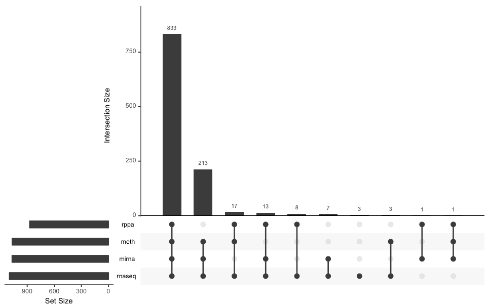
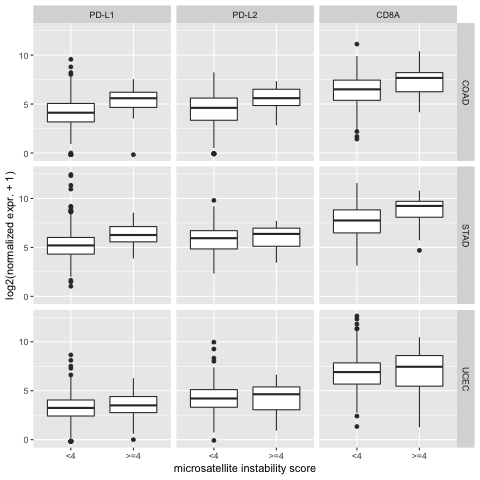
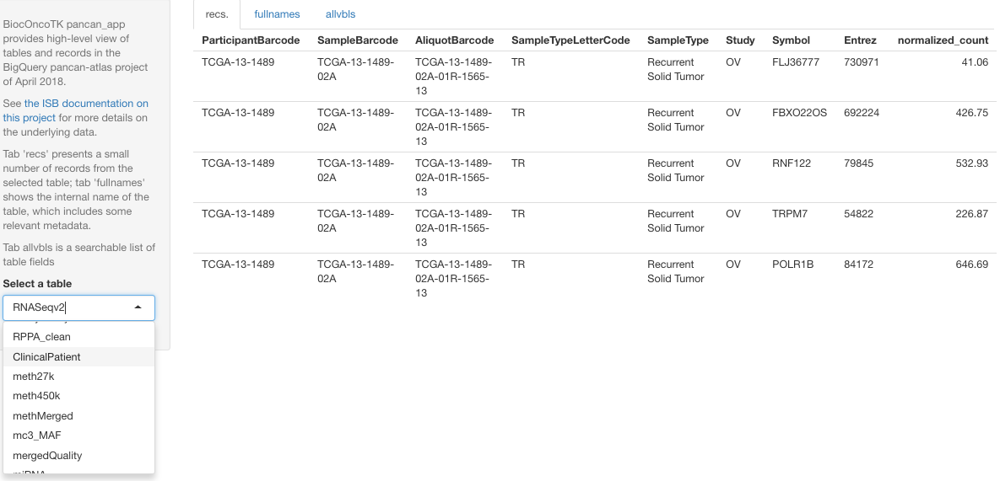

```{r setup,echo=FALSE,results="hide"}
suppressPackageStartupMessages({
suppressMessages({
library(BiocOncoTK)
library(BiocStyle)
library(dplyr)
library(DBI)
library(magrittr)
library(pogos)
library(org.Hs.eg.db)
library(restfulSE)
})
})
```

# Overview

This package provides a unified approach to programming with Bioconductor
components to address problems in cancer genomics.  Central concerns are:

- __Ontology applications__ that systematize the conceptual structure of
cancer biology.  There are particular concerns with structured vocabularies for
    - general human anatomy 
    - experimental cell lines
    - cancer therapeutics
    - genome and epigenome elements and alterations related to cancer
- __Communications infrastructure__ to support extraction and analysis of well-structured, self-describing
data from public archives and portals.  Key resource centers of interest include
    - [TCGA](https://cancergenome.nih.gov/), with curated representations through
        - the [ISB Cancer Genomics Cloud project](http://cgc.systemsbiology.net/)
        - Bioconductor's [curatedTCGAData](https://bioconductor.org/packages/curatedTCGAData/) interface
        - The [ISB pan-cancer atlas mirror](http://isb-cancer-genomics-cloud.readthedocs.io/en/latest/sections/PanCancer-Atlas-Mirror.html)
    - [TARGET](https://ocg.cancer.gov/programs/target) through ISB-CGC
    - [cBioPortal](http://www.cbioportal.org/); our main concern is to simplify usage of the RESTful API with R
    - [CLUE](http://clue.io), "a cloud-based software platform for the analysis of perturbational datasets generated using gene expression (L1000) and proteomic (P100 and GCP) assays"
    - [Ivy Glioblastoma Atlas Project](http://glioblastoma.alleninstitute.org/)
    - [TCIA](http://www.cancerimagingarchive.net/), with radiology and pathology
components available through [ISB/BigQuery](http://isb-cancer-genomics-cloud.readthedocs.io/en/latest/sections/TCGA-images.html)
    - [TCRN](https://cancerdatanetwork.org/): the TIES (Text Information Extraction System) Cancer Research Network -- we'll have to learn more about [JWT with httr](https://cran.r-project.org/web/packages/jose/vignettes/jwt.html) before progressing with this
    - [CONQUER](http://imlspenticton.uzh.ch:3838/conquer/), an archive of uniformly processed __single-cell RNA-seq__ datasets, a number of which related to cancer.  We have 'curated' CONQUER's version of the GBM
single cell study of [Patel et al. 2014](https://www.ncbi.nlm.nih.gov/pmc/articles/PMC4123637/), with the large data component
in an AWS S3 bucket.  Below we indicate how to retrieve the Patel data
for local computation.  A larger, more recent single
cell transcriptomics experiment in GBM is that of 
[Darmanis et al. 2017](https://www.ncbi.nlm.nih.gov/pmc/articles/PMC5810554/).
We curated the CONQUER representation of this experiment in a public HDF Object Store
and describe how to use it below.
- __Remote analysis support__ to "move the computation to the data".  Bridging [Google Cloud Datalab](https://cloud.google.com/datalab/) to the ISB TCGA and CCLE images is a first target.
- __Social coding practice__: at present, users and developers should use the [issue tracker](https://github.com/vjcitn/BiocOncoTK/issues)
at the [BiocOncoTK github repository](https://github.com/vjcitn/BiocOncoTK) to comment, critique, and propose new approaches.

# Ontology

## Oncotree

The NCI Thesaurus project distributes an OBO representation of oncotree.  We
can use this through the `r Biocpkg("ontoProc")` (devel branch only) and `r CRANpkg("ontologyPlot")`
packages.  Code for visualizing the location of 'Glioblastoma' in the context of its 'siblings'
in the ontology follows.

```{r lkgbm,fig=TRUE,message=FALSE}
library(ontoProc)
library(ontologyPlot)
oto = getOncotreeOnto()
glioTag = names(grep("Glioblastoma$", oto$name, value=TRUE))
st = siblings_TAG(glioTag, oto, justSibs=FALSE)
onto_plot(oto, slot(st, "ontoTags"), fontsize=50)
```

# Resource interfaces

## PanCancer Atlas

In conjunction with `r Biocpkg("restfulSE")` which handles
aspects of the interface to BigQuery, this package
provides tools for working with the PanCancer atlas
project data.

### Sample types

A key feature distinguishing the pancancer-atlas project
from TCGA is the availability of data from normal tissue or
metastatic or recurrent tumor samples.  Codes
are used to distinguish the different sources:
```{r lktata}
BiocOncoTK::pancan_sampTypeMap
```

### SummarizedExperiments per assay per tumor or other sample type

The following code will run if you have a valid setting
for environment variable `CGC_BILLING`, to allow 
BiocOncoTK::pancan_BQ() to generate a proper BigQueryConnection.

```{r lkl, eval=FALSE}
library(BiocOncoTK)
if (nchar(Sys.getenv("CGC_BILLING"))>0) {
 pcbq = pancan_BQ() # basic connection
 BRCA_mir = restfulSE::pancan_SE(pcbq)
}
```
The result is

```
> BRCA_mir
class: SummarizedExperiment 
dim: 743 1068 
metadata(0):
assays(1): assay
rownames(743): hsa-miR-30d-3p hsa-miR-486-3p ... hsa-miR-525-3p
  hsa-miR-892b
rowData names(0):
colnames(1068): TCGA-LD-A7W6 TCGA-BH-A18I ... TCGA-E9-A1N9 TCGA-B6-A0X0
colData names(746): bcr_patient_uuid bcr_patient_barcode ...
  bilirubin_upper_limit days_to_last_known_alive
```

### Subsetting to normal

To shift attention to the normal tissue samples provided, use
```{r lknor,eval=FALSE}
 BRCA_mir_nor = restfulSE::pancan_SE(pcbq, assaySampleTypeCode="NT")
```
to find
```
class: SummarizedExperiment 
dim: 743 90 
metadata(0):
assays(1): assay
rownames(743): hsa-miR-7641 hsa-miR-135a-5p ... hsa-miR-1323
  hsa-miR-520d-5p
rowData names(0):
colnames(90): TCGA-BH-A18P TCGA-BH-A18S ... TCGA-E9-A1N6 TCGA-E9-A1N9
colData names(746): bcr_patient_uuid bcr_patient_barcode ...
  bilirubin_upper_limit days_to_last_known_alive
```
The intersection of the colnames from the two SummarizedExperiments
thus formed (patients contributing
both solid tumor and matched normal) has length 89. 

<!--
function (bqcon, colDataTableName = "clinical_PANCAN_patient_with_followup", 
    colDSubjectIdName = "bcr_patient_barcode", colDFilterField = "acronym", 
    colDFilterValue = "BRCA", assayDataTableName = "pancanMiRs_EBadjOnProtocolPlatformWithoutRepsWithUnCorrectMiRs_08_04_16_annot", 
    assayFeatureName = "ID", subjectIDName = "ParticipantBarcode", 
    tumorFieldName = "Study", tumorFieldValue = "BRCA", assayValueFieldName = "miRNAexpr") 
NULL
-->

<!--
tumNorSet = function(bq, code="PRAD", assayDataTableName=pancan_longname("rnaseq"),
     assayValueFieldName="normalized_count", assayFeatureName="Entrez") {
 lapply(c("TP", "NT"), function(x)
   pancan_SE(bq, colDFilterValue=code, assayDataTableName=assayDataTableName, assaySampleTypeCode=x,
    tumorFieldValue=code, assayValueFieldName=assayValueFieldName, assayFeatureName=assayFeatureName))
}
-->

### Shifting focus to another tissue/assay

You need to know what type of sample has been assayed for
the tumor type of interest.

Here is how you find the candidates.
```{r dotab, eval=FALSE}
bqcon %>% tbl(pancan_longname("rnaseq")) %>% filter(Study=="GBM") %>% 
   group_by(SampleTypeLetterCode) %>% summarise(n=n())
```

To get RNA-seq on recurrent GBM samples:
```{r lkgbmr, eval=FALSE}
pancan_SE(bqcon, colDFilterValue="GBM", tumorFieldValue="GBM", 
  assayDataTableName=pancan_longname("rnaseq"), 
  assaySampleTypeCode="TR", assayFeatureName="Symbol", 
  assayValueFieldName="normalized_count")
```


### Multiassay experiments per tumor

Suppose we want to work with the mRNA, RPPA, 
27k/450k merged methylation and miRNA data together.
We can invoke pancan_SE again, specifying the appropriate
tables and fields.
```{r dose2, eval=FALSE}
BRCA_mrna = pancan_SE(pcbq,
   assayDataTableName = pancan_longname("rnaseq"),
   assayFeatureName = "Entrez",
   assayValueFieldName = "normalized_count")
BRCA_rppa = pancan_SE(pcbq,
   assayDataTableName = pancan_longname("RPPA"),
   assayFeatureName = "Protein",
   assayValueFieldName = "Value")
BRCA_meth = pancan_SE(pcbq,
   assayDataTableName = pancan_longname("27k")[2],
   assayFeatureName = "ID",
   assayValueFieldName = "Beta")
```

After obtaining the clinical data for BRCA with
```
library(dplyr)
library(magrittr)
clinBRCA = pcbq %>% tbl(pancan_longname("clinical")) %>% 
  filter(acronym=="BRCA") %>% as.data.frame() 
rownames(clinBRCA) = clinBRCA[,2]
clinDF = DataFrame(clinBRCA)
```
we use
```
library(MultiAssayExperiment)
brcaMAE = MultiAssayExperiment(
  ExperimentList(rnaseq=BRCA_mrna, meth=BRCA_meth, rppa=BRCA_rppa,
    mirna=BRCA_mir),colData=clinDF)
```
to generate `brcaMAE`.  No assay data are present in
this object, but data are retrieved on request.
```
> brcaMAE
A MultiAssayExperiment object of 4 listed
 experiments with user-defined names and respective classes. 
 Containing an ExperimentList class object of length 4: 
 [1] rnaseq: SummarizedExperiment with 20531 rows and 1097 columns 
 [2] meth: SummarizedExperiment with 22601 rows and 1067 columns 
 [3] rppa: SummarizedExperiment with 259 rows and 873 columns 
 [4] mirna: SummarizedExperiment with 743 rows and 1068 columns 
Features: 
 experiments() - obtain the ExperimentList instance 
 colData() - the primary/phenotype DataFrame 
 sampleMap() - the sample availability DataFrame 
 `$`, `[`, `[[` - extract colData columns, subset, or experiment 
 *Format() - convert into a long or wide DataFrame 
 assays() - convert ExperimentList to a SimpleList of matrices
```

It is convenient to check for sample availability for the
different assays using `upsetSamples` in `r Biocpkg("MultiAssayExperiment")`.




### Reassessing immune infiltrate signatures in relation to microsatellite instability

The following code produces figure 1 of the restfulSE
paper.


```{r dofig1,eval=FALSE}
library(BiocOncoTK)

 infilGenes = c(`PD-L1`="CD274", `PD-L2`="PDCD1LG2", CD8A="CD8A")
 tumcodes = c("COAD", "STAD", "UCEC")
 combs = expand.grid(tumcode=tumcodes, ali=names(infilGenes),
    stringsAsFactors=FALSE)
 combs$sym = infilGenes[combs$ali]

 bq = pancan_BQ()
 exprByMSI = function(bq, tumcode, genesym, alias) {
  print(tumcode)
  if (missing(alias)) alias=genesym
  ex = bindMSI(buildPancanSE(bq, tumcode, assay="RNASeqv2"))
  ex = replaceRownames(ex)
  data.frame(
   patient_barcode=colnames(ex),
   acronym=tumcode,
   symbol = genesym,
   alias = alias,
   log2ex=log2(as.numeric(SummarizedExperiment::assay(ex[genesym,]))+1),
   msicode = ifelse(ex$msiTest >= 4, ">=4", "<4"))
 }
 allshow = lapply(1:nrow(combs), function(x) exprByMSI(bq, combs$tumcode[x],
    combs$sym[x], combs$ali[x]))
 
 rr = do.call(rbind, allshow)
 
 library(ggplot2)
 png(file="microsatpan2.png")
 ggplot(rr,
    aes(msicode, log2ex)) + geom_boxplot() +
    facet_grid(acronym~alias) +
    ylab("log2(normalized expr. + 1)") +
    xlab("microsatellite instability score")
 dev.off()
```




## Non-coding variants

The `ggMutDens`, `ggFeatDens` and `ggFeatureSegs` functions
were created to support the image given here.  `ggMutDens`
in particular depends upon a working BigQuery connection to
the ISB-CGC PanCan-atlas project.


## Supporting infrastructure

The API for `pancan_SE` in `r Biocpkg("restfulSE")` is complicated.
```{r lkapi}
args(restfulSE::pancan_SE)
```

Long, metadata-laden names are used for some tables,
the clinical characteristics table has over 700 variables,
and fields bearing information common to different tables
may not have common names.  Help is needed to permit
programming for integrative analysis.  BiocOncoTK provides
the following assistance:

- `pancan_app`: a shiny app that provides interactive table and data 
overviews



- `pancan_longname`: a helper for generating the long table names
using a hint that will be processed by `agrep`:
```{r lklo}
pancan_longname("rnaseq")
```

- `pancan_BQ`: a function that will generate a BigQueryConnection
instance provided billing code and Google authentication succeed.


## TARGET

We assume that an ISB-CGC Google BigQuery billing number
is assigned to the environment variable `CGC_BILLING`.

First we list the tables available and have a look at the
RNA-seq table.
```{r lktarg, message=FALSE,eval=FALSE}
billco = Sys.getenv("CGC_BILLING")
if (nchar(billco)>0) {
  con = DBI::dbConnect(bigrquery::bigquery(), project="isb-cgc",
     dataset="TARGET_hg38_data_v0", billing=billco)
  DBI::dbListTables(con)
  con %>% tbl("RNAseq_Gene_Expression") %>% glimpse()
  }
```
```
## Observations: NA
## Variables: 16
## $ project_short_name <chr> "TARGET-RT", "TARGET-RT", "TARGET-RT", "TARGE...
## $ case_barcode       <chr> "TARGET-52-PARPFY", "TARGET-52-PARPFY", "TARG...
## $ sample_barcode     <chr> "TARGET-52-PARPFY-11A", "TARGET-52-PARPFY-11A...
## $ aliquot_barcode    <chr> "TARGET-52-PARPFY-11A-01R", "TARGET-52-PARPFY...
## $ gene_name          <chr> "RIC8B", "ATOH7", "ZNF532", "XKR5", "RP11-33O...
## $ gene_type          <chr> "protein_coding", "protein_coding", "protein_...
## $ Ensembl_gene_id    <chr> "ENSG00000111785", "ENSG00000179774", "ENSG00...
## $ Ensembl_gene_id_v  <chr> "ENSG00000111785.17", "ENSG00000179774.8", "E...
## $ HTSeq__Counts      <int> 2396, 35, 5367, 17, 323, 1718, 1, 4, 3151, 25...
## $ HTSeq__FPKM        <dbl> 3.212811104, 0.247184268, 4.693986615, 0.0353...
## $ HTSeq__FPKM_UQ     <dbl> 7.790066e+04, 5.993448e+03, 1.138145e+05, 8.5...
## $ case_gdc_id        <chr> "5cdd05ea-5285-50b7-971a-8bc005d01669", "5cdd...
## $ sample_gdc_id      <chr> "7448bf2b-4ba0-5f98-ad0f-e87fa6619a43", "7448...
## $ aliquot_gdc_id     <chr> "TARGET-52-PARPFY-11A-01R", "TARGET-52-PARPFY...
## $ file_gdc_id        <chr> "f31fe296-402e-4e7d-b072-e4a6571a9c8a", "f31f...
## $ platform           <chr> "Illumina", "Illumina", "Illumina", "Illumina...
```

Now let's see what tumor types are available.
```{r lklk, message=FALSE, warning=FALSE,eval=FALSE}
if (nchar(billco)>0) {
  con %>% tbl("RNAseq_Gene_Expression") %>% 
      select(project_short_name) %>%
      group_by(project_short_name) %>%
      summarise(n=n())
}
```
```
## # Source: lazy query [?? x 2]
## # Database: BigQueryConnection
##   project_short_name        n
##   <chr>                 <int>
## 1 TARGET-NBL          9495831
## 2 TARGET-AML         11310321
## 3 TARGET-RT            302415
## 4 TARGET-WT           7983756
```

NBL is neuroblastoma, RT is rhabdoid tumor, WT is
Wilms' tumor.

## CCLE

Figure 3a of Barretina et al 2012 shows that cell lines with
NRAS mutations can be ordered according to a measure of
PD-0325901 activity, and that this drug activity measure
is correlated with expression of AHR.  We will acquire the
mutation and expression data using BigQuery as provided by ISB.

Here is a listing of all tables:
```{r lkccle2, message=FALSE, eval=FALSE}
billco = Sys.getenv("CGC_BILLING")
if (nchar(billco)>0) {
  con = DBI::dbConnect(bigrquery::bigquery(), project="isb-cgc",
     dataset="ccle_201602_alpha", billing=billco)
  DBI::dbListTables(con)
}
```
```
## [1] "AffyU133_RMA_expression" "Copy_Number_segments"   
## [3] "DataFile_info"           "Mutation_calls"         
## [5] "Sample_information"      "fastqc_metrics"
```

### Mutation data

<!--
 [1] "CCLE_bioclin_v0"     "GDC_metadata"        "GTEx_v7"            
 [4] "QotM"                "TARGET_bioclin_v0"   "TARGET_hg38_data_v0"
 [7] "TCGA_bioclin_v0"     "TCGA_hg19_data_v0"   "TCGA_hg38_data_v0"  
[10] "Toil_recompute"      "ccle_201602_alpha"   "genome_reference"   

# CCLE datasets
[1] "AffyU133_RMA_expression" "Copy_Number_segments"   
[3] "DataFile_info"           "Mutation_calls"         
[5] "Sample_information"      "fastqc_metrics"         
-->

First we get an overview of the content:

```{r lkmucc,eval=FALSE}
muttab = con %>% tbl("Mutation_calls")
length(muttab %>% colnames())
muttab %>% select(Cell_line_primary_name, Hugo_Symbol, 
   Variant_Classification, cDNA_Change)%>% glimpse()
```
```
## [1] 53
```

Now let's filter by NRAS and get a feel for how many
observations are returned per cell line.

```{r lknras, warning=FALSE,eval=FALSE}
nrastab = muttab %>% select(Variant_Classification, Hugo_Symbol, 
    Cell_line_primary_name, CCLE_name) %>%
     filter(Hugo_Symbol == "NRAS") %>% group_by(Hugo_Symbol) 
nrastab %>% summarise(n=n())
nrasdf = nrastab %>% as.data.frame()
```

We need to carve up the CCLE name to get the organ.
```{r dospl,eval=FALSE}
spl = function(x) {
  z = strsplit(x, "_")
  fir = vapply(z, function(x)x[1], character(1))
  rest = vapply(z, function(x) paste(x[-1], collapse="_"), character(1))
  list(fir, rest)
}
nrasdf$organ = spl(nrasdf$CCLE_name)[[2]]
```
```{r getmodnr,echo=FALSE}
nrasdf = load_nrasdf()
```{r illus}
head(nrasdf)
table(nrasdf$organ)
prim_names = as.character(nrasdf$Cell_line_primary_name)
```


### Expression data

Let's obtain the expression of AHR for these NRAS-mutated cell lines.

```{r lkccleex, message=FALSE, warning=FALSE, eval=FALSE}
ccexp = con %>% tbl("AffyU133_RMA_expression") 
ccexp %>% glimpse()
ccexp %>% select(Cell_line_primary_name, RMA_normalized_expression,
    HGNC_gene_symbol) %>% filter(HGNC_gene_symbol == "AHR") %>% 
    filter(Cell_line_primary_name %in% nrasdf$Cell_line_primary_name) %>%
    as.data.frame() -> NRAS_AHR
head(NRAS_AHR)
```
```{r domockahr,echo=FALSE}
NRAS_AHR = load_NRAS_AHR()
head(NRAS_AHR)
```

### Drug responsiveness data from CCLE, using pogos

The pogos package (submitted, see github.com/vjcitn/pogos)
includes software to query pharmacodb.pmgenomics.ca.
We will use this to develop drug-response profiles
for PD-0325901.

```{r dopog,eval=FALSE}
library(pogos)
ccleNRAS = DRTraceSet(NRAS_AHR[,1], drug="PD-0325901")
plot(ccleNRAS)
```
```{r dopogmock,echo=FALSE,results="hide",fig=TRUE}
ccleNRAS = load_ccleNRAS()
plot(ccleNRAS)
```

We'll define a responsiveness method, that takes a function f
that is applied to the responses component of the dose-response
profile.
```{r drrr}
responsiveness = function (x, f) 
{
    r = sapply(slot(x, "traces"), function(x) f(slot(slot(x,"DRProfiles")[[1]],"responses")))
    data.frame(Cell_line_primary_name = slot(x,"cell_lines"), resp = r, 
        drug = slot(x,"drug"), dataset = x@dataset)
}
```

The activity area for a compound in this design is defined as
```{r lkaa}
AA = function(x) sum((pmax(0, x/100)))
head(rr <- responsiveness(ccleNRAS, AA))
summary(rr$resp)
```
This is based on the supplement to Barretina et al. 2012.  (There
a slightly different formula in the addendum which uses notation that includes
multiplying by a factor of i for
dose index level i.)

Let's merge the responsiveness data with the expression data for
gene AHR.

```{r mrg}
rexp = merge(rr, NRAS_AHR)
rexp[1:2,]
```

### CLUE

The CLUE platform is an interface to results of work on the connectivity map at Broad
Institute.  Usage of functions in this toolkit requires an API key, which can be
acquired through registration at clue.io.  Set the environment variable
`CLUE_KEY` so that it can be found by `Sys.getenv` to use default `key` parameter
to functions described here.

A basic purpose of the interface to CLUE is to allow identification of
gene signatures of perturbations in specific cellular contexts.

We have serialized data on cell lines and perturbagens available in
the GSE70138 snapshot of LINCS.

```{r lkda}
data(cell_70138)
names(cell_70138)
table(cell_70138$primary_site)
data(pert_70138)
dim(pert_70138)
names(pert_70138)
```

A number of API services have demonstration query expressions available
in the package:
```{r lkdem}
cd = clueDemos()
names(cd)
cd$sigs
```

We use `query_clue` to query a service.  Here we ask for
perturbagens that have EGFR among their targets.  We'll retrieve
a single 'gold' signature identifier.

```{r lkp1}
if (nchar(Sys.getenv("CLUE_KEY"))>0) {
lkbytarg = query_clue(service="perts", filter=list(where=list(target="EGFR")))
print(names(lkbytarg[[1]]))
sig1 = lkbytarg[[1]]$sig_id_gold[1]
}
```

Now we obtain the metadata about this signature.
```{r lkp2}
if (nchar(Sys.getenv("CLUE_KEY"))>0) {
sig1d = query_clue(service="sigs", filter=list(where=list(sig_id=sig1)))
print(names(sig1d[[1]]))
print(head(sig1d[[1]]$pert_iname)) # perturbagen
print(head(sig1d[[1]]$cell_id))  # cell type
print(head(sig1d[[1]]$dn50_lm))  # some downregulated genes among the landmark
print(head(sig1d[[1]]$up50_lm))  # some upregulated genes among the landmark
}
```

#### Example

Task: Assess the effects of perturbagens on transcription
in the NPC cell line.  We'll check for recurrence of landmark
genes among the top 50 upregulated for perturbagens that
are identified as HDAC inhibitors.


```{r lknpc, cache=TRUE}
# use pertClasses() to get names of perturbagen classes in Clue
if (nchar(Sys.getenv("CLUE_KEY"))>0) {
tuinh = query_clue("perts", 
   filter=list(where=list(pcl_membership=list(inq=list("CP_HDAC_INHIBITOR"))))) 
inames_tu = sapply(tuinh, function(x)x$pert_iname)

npcSigs = query_clue(service="sigs", filter=list(where=list(cell_id="NPC")))
length(npcSigs)
gns = lapply(npcSigs, function(x) x$up50_lm)
perts = lapply(npcSigs, function(x) x$pert_iname)
touse = which(perts %in% inames_tu)
rec = names(tab <- sort(table(unlist(gns[touse])),decreasing=TRUE)[1:5])
cbind(select(org.Hs.eg.db, keys=rec, columns="SYMBOL"), n=as.numeric(tab))
}
```

We can abstract from this process a function that takes perturbagen classes
and cell lines to deliver collections of LINCS signatures of genes considered
to produce transcriptional activities of certain kinds.

# Curated single cell expression data from cancer studies

In this section we illustrate different modalities for
acquiring and working with single cell transcriptomics data,
after processing by the CONQUER workflow.

## Patel 2014

The Patel et al. experiment assayed 864 cells.
A standard in-memory representation is straightforward.
The curated SummarizedExperiment is distributed in an AWS S3
bucket sponsored by the Bioconductor Foundation.  The `loadPatel`
function retrieves this and places it in a `r Biocpkg("BiocFileCache")
instance.

```{r trylop}
if (interactive()) {
 patelSE = loadPatel() # uses BiocFileCache
 patelSE
 assay(patelSE[1:4,1:3]) # in memory
}
```

Exploratory analysis of this dataset is described in the companion vignette
on single cell transcriptomics for GBM.

## Darmanis 2017

The Darmanis et al. experiment assayed over 3500 cells.  The
CONQUER compressed RDS representation of all the data is about
4 GB on disk.  The gene level quantifications and sample-level data
were manually extracted from this archive.  The gene level quantifications
in the `count_lstpm` form were then loaded into a public HDF object store
sponsored by John Readey.  These data will persist in this format for some time; a
Bioconductor-sponsored representation will be introduced as soon as possible.

```{r lkdar}
darmSE = BiocOncoTK::darmGBMcls  # count_lstpm from CONQUER
darmSE
assay(darmSE)  # out of memory
```

# Summary

`BiocOncoTK` is a result of work carried out under NCI ITCR U01 "Accelerating
cancer genomics with cloud-scale Bioconductor".  This package illustrates
several Bioconductor-based representations of cancer data and metadata.
Some of the resources, such as the PanCancer atlas, CCLE, and high-resolution
single-cell transcriptomics studies are sufficiently large that cloud-oriented
representation and analysis may be cost-effective.  As this package matures,
additional resources will be highlighted, with particular attention to
integration processes.
